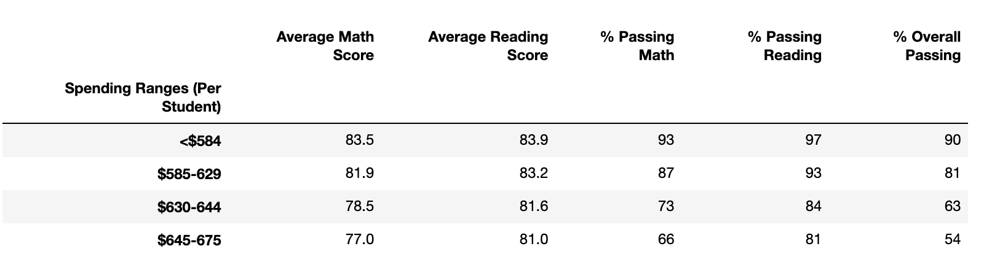
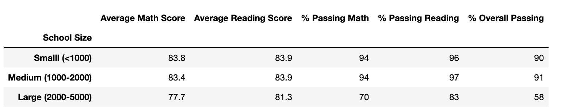

# School District Analysis 

## Project Overview

The purpose of this analysis is to practice performing a complete analysis on a dataset using new tools including Pandas and Jupyter Notebook. In this exercise, we had to create a virtual environment and add it to our IDE, Jupyter Notebook. This allowed us to write code and perform an analysis using the same programming languages and versions as other team members. We practiced importing CSV files, cleaning datasets, and merging datasets. Also through this analysis, we became familiar with many of the commonly used Pandas methods and functions used to perform analysis including creating DataFrames, `loc`, `groupby`, `map`, and `pd.cut`. 
The purpose of the analysis was to compile information regarding schools' performance that would assist the school board's planning for the upcoming academic year. We presented students' math and reading scores as related to certain factors such as spending per student, size, and type of school. The initial analysis that was done included all student scores. However, due to suspicion of academic dishonesty, the school board has requested that the math and reading scores for Thomas High School's ninth-graders be removed and the analysis performed again. 

## Results

- How is the district summary affected?
As can been seen in the images below, there were only slight differences in the `district_summary_df` using all data compared to the when it was performed with the scores omitted. The average math score for students in the district was 78.9. The average math score with the questionable scores omitted was 79.0. In the district summary using all scores was 75% and reduced slightly to 74.8% when the questionable scores were omitted. The average reading score for students was unchanged and remained at 81.9 in both district summaries. However, 86% passed reading in the district summary using all student scores and was slightly lower at 85.7% when the questionable scores were omitted.

**District Summary from challenge**

**District Summary from module**

- How is the school summary affected?
Below are images of the `per_school_summary_df` performed during the challenge, in which the ninth-grade scores from Thomas High School were removed, and the analysis performed during the module, which includes all student scores. Since Thomas High School is the only school with questionable scores, the differences in the two school summaries are limited to Thomas High School. The average scores and percent of students passing were slightly higher when all student scores were included in the analysis. The average math score was 0.067 higher, the average reading score was 0.047 higher, the percent of students passing math was 0.086% higher, the percentage of students passing reading was 0.290% higher, and the percentage of students passing both was 0.318% higher when all student scores were included compared to when the scores in question were removed due to potential academic dishonesty.

**School Summary from challenge**

**School Summary from module**

- How does replacing the ninth graders' math and reading scores affect Thomas High School's performance relative to others schools?
Replacing the ninth graders' math and reading scores did not have a significant affect on Thomas High School's performance relative to other schools. School performance was determined by the `% Overall Passing` column. As discussed earlier, the percentage of students passing both math and reading from Thomas High School was slightly higher when all student scores were included in the analysis. However, Thomas High School remains the second top performing high school in the district regardless if the scores are omitted from the analysis. 

**Top Schools from challenge**

**Top Schools from module**

- How does replacing the ninth-grade scores affect the following:
	- Math and reading scores by grade
	The analysis of the math and reading scores by grade are unaffected because we presented the scores by school. Therefore, the only 				difference is that the 9th grade math and reading scores for Thomas High School show "nan" or no value. 

**Math Scores by Grade from challenge**

**Reading Scores by Grade from challenge**

**Math Scores by Grade from module**

**Reading Scores by Grade from module**

	- Scores by school spending
There was no difference in the scores by school spending when the formatted DataFrames are reviewed. Thomas High School falls into the spending range of $630-644 and that is the bin that would have an expected effect. However, in the formatted DataFrame, average math score, average reading score, and passing percentages all remained the same regardless of whether the scores were included or not. When you review the unformatted DataFrames, there is a slight difference when the ninth grade scores are removed. For example, the average math score without the scores included is 78.502 and 78.518 when the scores are excluded. Both these scores round to 78.5 in the final DataFrame presented. 

**Spending Summary from challenge (formatted)**

**Spending Summary from module (formatted)**

**Spending Summary from challenge (unformatted)**

**Spending Summary from module (unformatted)**

	- Scores by school size
There was no difference in the scores by school size either. Thomas High School falls into the Medium (1000-2000) size range. However, the scores and passing percentages for the Medium size range remained the same regardless of whether or not the questionable scores were included. 

**Size Summary from challenge**

**Size Summary from module**

	- Scores by school type
Lastly, the scores by school type remained unaffected by the removal of the ninth grade scores from Thomas High School. Thomas High School is charter school so that would be the row in which a change would be expected. However, due to the overall small difference in average scores and passing percentages when the scores were removed, the overall scores and passing percentages based on school type were unaffected. 

**Type Summary from challenge**

**Type Summary from module**

## Summary
When we remove Thomas High School's ninth grade scores and repeat the analysis, the results do not change significantly. The math and reading scores and the percentage of passing students were evaluated by school spending, school size, and school type. As discussed in the scores by spending explanation earlier, the changes for these analyses are not reflected in the formatted DataFrame due to the rounding. The four changes that are observed for the updated school district analysis are in the `district_summary_df`, `per_school_summary_df`, `math_scores_by_grade`, and `reading_scores_by_grade`. In the `district_summary_df`, we observe a slight decrease in the average math score, percent passing math, percent passing reading, and overall passing when the scores are excluded. The average reading score remains the same in both analyses. In the `per_school_summary_df`, we see changes in the Thomas High School index. There is a decrease in average math score, average reading score, percent passing math, percent passing reading, and percent of overall passing when the scores are omitted. In both the `math_scores_by_grade` and `reading_scores_by_grade`, we can see clearly that the grades for Thomas High School ninth graders have been replaced with NaN, which is no value. 

